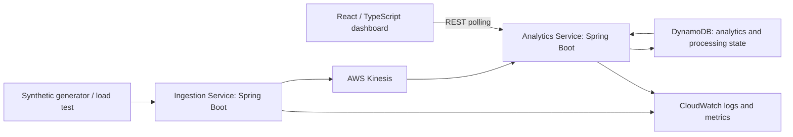

# Architecture

This document remains the architecture specification. Phase 1 implements the local ingestion → Kinesis/KCL → DynamoDB → summary slice. The dashboard, remaining query endpoints, cloud deployment, and benchmark remain planned. See [local backend](local-backend.md) for commands and verification boundaries.

## Boundaries and scope

The Ingestion Service validates the [event contract](event-model.md), publishes to Kinesis, and reports whether AWS acknowledged the write. It never computes analytics or writes DynamoDB. The Analytics Service owns KCL consumption, deduplication, aggregates, quarantine, recent-event storage, and query APIs. Its HTTP server and consumer run in the same deployment; bounded separate executor pools prevent one from taking all threads. This is a deliberate coupling, not a third service hidden in the design.

The dashboard shows gross/refund/net revenue, payment count, average order value, refund event ratio, category and regional payment distributions, and recently processed events. It labels event-time activity separately from processing throughput. CloudWatch supplies operator-level errors and lag; the UI does not pretend that a successful query proves the stream is caught up. See [API](api-contract.md), [storage](dynamodb-access-patterns.md), [deployment](deployment-plan.md), and [security](security.md).

MVP non-goals: payment processing, real customer information, an authentication platform, recommendations, machine learning, generative AI, shopping carts, a product catalog, fulfillment, notifications, Kafka, Kubernetes, service mesh, additional microservices, GraphQL, and event-sourcing or CQRS frameworks. No historical warehouse, arbitrary SQL, order lifecycle enforcement, or currency conversion.

## Stream and producer

One environment-scoped `commerce-events` stream carries one JSON fact per record. Start with one provisioned shard and 24-hour retention for short experiments. Both are configuration parameters recorded with each run. Normal development traffic is small and intermittent; higher load, including a thousands-per-second objective, is unmeasured. Size the stream using both bytes and records and observed partition skew. AWS documents a per-shard write allowance of 1 MB/s or 1,000 records/s; these are service limits, not application results. [AWS PutRecords reference](https://docs.aws.amazon.com/kinesis/latest/APIReference/API_PutRecords.html)

Partition key is `orderId`: random synthetic order IDs spread traffic while colocating related payment/refund facts. A single disproportionately busy order remains a hot key; extra shards cannot split that key. Do not key by region or category. Kinesis sequence numbers order accepted records within a shard, not globally or by business time. Concurrent requests, ambiguous write retries, and future batching may reorder facts. Aggregations are additive and do not depend on payment preceding refund.

MVP ingestion uses SDK `PutRecord` per HTTP request, with bounded concurrency, no unbounded in-memory queue, and no early acknowledgement. Use an overall publish deadline of 5 seconds, up to three SDK attempts with exponential backoff and full jitter, capped at 1 second between attempts. Return 202 only on acknowledgement; return 503 on unresolved timeout/failure, even though the record might already exist. Clients retry identical IDs and bodies with jitter and a finite retry budget. A new request ID is allowed. Never claim a failed HTTP response proves non-delivery. Future `PutRecords` optimization requires per-record result handling and retry of only failed/unknown records; batching does not provide ordering. [AWS producer semantics](https://docs.aws.amazon.com/streams/latest/dev/developing-producers-with-sdk.html)

## Consumer and durable outcomes

Use Java Kinesis Client Library (KCL) 3.x, standard polling, a stable environment-scoped application name, and one active owner per shard lease. First startup explicitly configures the KCL single-stream tracker and lease configuration with TRIM_HORIZON; subsequent startup resumes checkpoints. All Analytics Service replicas share the application name. A different application name is a separate reader and can replay retained records. KCL owns its metadata: lease, worker metrics, and coordinator state tables. They are separate from application tables, require IAM permissions, and incur charges. [KCL metadata](https://docs.aws.amazon.com/streams/latest/dev/kcl-dynamoDB.html)

Within each shard callback, process in sequence and await a durable outcome before advancing. MVP uses one in-flight event transaction per shard; parallelism comes from shards. This may be a substantial throughput limit and must be measured before adding per-shard concurrency. Checkpoint the last contiguous durable record at callback completion and on graceful shutdown/shard end, never past a pending record. No KPL record aggregation in the MVP.

1. Decode and validate the record, including the event model's arrival-relative timestamp bounds. If occurrence time is already eight days old at processing, stop the shard and declare a retention-gap incident rather than writing expired aggregates; this is an unsupported recovery condition, not a poison record.
2. Build deterministic item keys and canonical payload hash.
3. Atomically write the deduplication marker, recent event, and three aggregate updates as described in the storage specification.
4. On duplicate-condition failure, strongly read the marker. Matching hash is a durable duplicate outcome. Different hash is a conflict that must be quarantined durably before checkpointing.
5. Only committed, verified-duplicate, or durably quarantined records may advance the checkpoint.

Transient throttling, transaction conflicts, and network failures retry the same event with exponential full jitter (100 ms base, 5-second cap). Keep retrying until recovery or shutdown, while pausing shard progress; do not discard after a retry count. SDK attempts and outer retry attempts must be separately bounded to avoid nested retry storms. Unknown transaction outcomes are resolved by the marker read/retry, never by incrementing counters separately. Permission errors, missing resources, and programmer errors stop progress and alert rather than classifying every record as poison.

Malformed JSON, unsupported schemas, invalid fields, and ID conflicts are permanent data failures. Store a quarantine item keyed by stream/shard/sequence number with a safe reason code, byte length, payload hash, and timestamps; do not store arbitrary raw payload. A repeated quarantine write is conditionally ignored. If quarantine persistence fails, the shard waits. Operators inspect CloudWatch and quarantine with AWS credentials; there is no public debugging API or automatic redrive endpoint. Corrected synthetic facts use new IDs; valid infrastructure-failure records resume in place.

If a process crashes before the transaction, replay processes the event. If it crashes after commit but before checkpoint, replay sees the marker and does not change totals. Checkpoint failures retry or let lease recovery replay. On lease loss stop dispatching; concurrent former/new owners are still protected by DynamoDB conditions. On SIGTERM stop new requests/records, finish bounded in-flight work, and checkpoint only completed work; expiration of the shutdown grace period safely leaves work for replay.

This is at-least-once delivery with atomic deduplicated effects in a defined retention envelope, not exactly-once delivery. It cannot detect a producer assigning two IDs to the same economic fact.

## Backpressure, scaling, and visibility

Ingestion concurrency and rate caps produce 429 before memory exhaustion. Consumer buffers and DynamoDB connections are bounded. A slow downstream pauses consumption and increases iterator age. Alert on sustained throttling and lag above 60 seconds, with an urgent alarm at one hour; these are operator thresholds, not latency guarantees. If recovery cannot complete before the oldest unprocessed record expires, stop the experiment and mark the dataset incomplete. Extending retention before expiry buys time at a cost; expired records cannot be recovered from this design. Rebuild a fresh dataset from the deterministic generator manifest. Default stream retention is 24 hours. [AWS retention](https://docs.aws.amazon.com/streams/latest/dev/kinesis-extended-retention.html)

Scale ingestion tasks based on saturation and latency, consumers based on lag plus CPU/DynamoDB pressure, and shards based on write/read saturation. More consumer replicas than useful shard parallelism do not improve processing. KCL handles lease transfer and parent/child shard progression during resharding. Fix a hot aggregate, throttled DynamoDB table, or failing transaction before adding consumers. Dataset layout uses 16 aggregate stripes to reduce item contention; changing that count requires a new dataset, not a rolling configuration change.

JSON logs include timestamp, severity, service, environment, requestId where available, eventId for valid events, and safe error codes. Ingestion logs receipt outcome; consumer logs duplicates/conflicts/failures. Phase 1 also logs each committed event for local inspection; success-log sampling must be added before load testing. No payload dumps. Planned application metrics (not yet exported in Phase 1): ingress acknowledged/rejected/unknown outcomes, processing commits/duplicates/quarantines/retries, transaction latency, HTTP latency/status, KCL iterator age, and resource saturation. IDs belong in logs, never metric dimensions. CloudWatch metric dimensions are service/environment/outcome; KCL metrics use its supported dimensions. Counters in logs/metrics are diagnostic, not an atomic accounting ledger.

## Engineering constraints

Prefer concrete classes and explicit transformations. No base services, generic repository frameworks, trivial wrappers, single-implementation interfaces without a test/design need, or speculative utility packages. Comments explain retry boundaries, atomicity, and surprising constraints. Keep event fixtures and contract tests aligned across services rather than introducing a shared domain framework. The largest limitation is the cost and contention of per-event transactional aggregates plus query fan-out; neither high throughput nor low cloud cost is established until measured.
